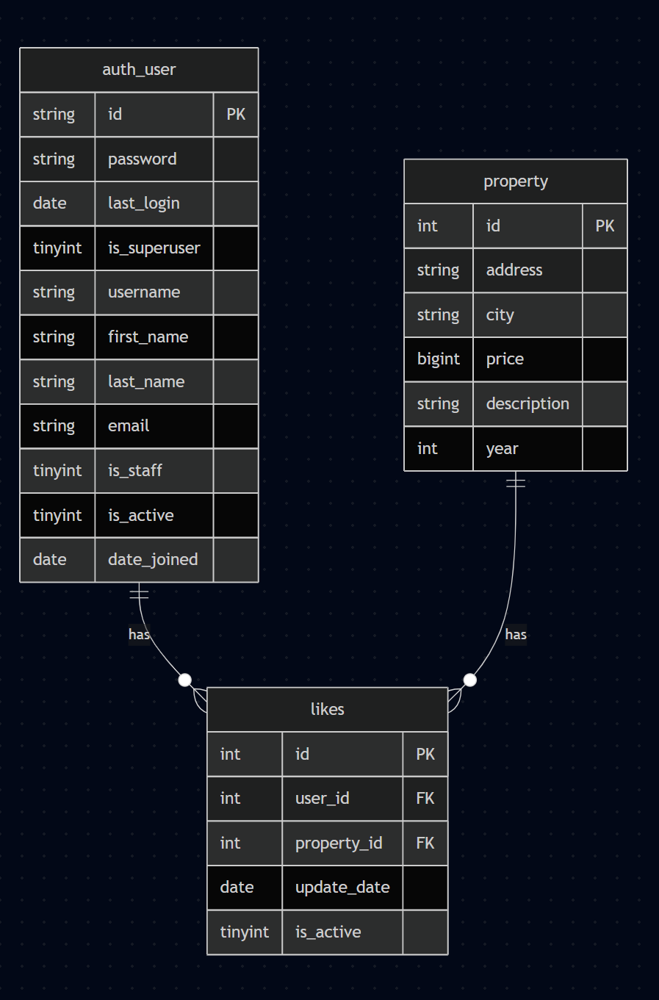

# prueba_tecnica_hb

### Tecnologias a utilizar

- Python 3.12
- http
- urllib
- json
- requests
- pydantic
- python-dotenv
- pytest
- git
- ruff
- pylint


### Abordaje del problema Servicio de Consulta de Inmuebles

Para este problema, aplico Vertical slicing, permitiendo enfocar la estructura del proyecto en las entidades del negocio, este tipo de abordaje permite dividir el problema en partes más pequeñas y manejables, lo que facilita la comprensión y el desarrollo del mismo.La estructura del proyecto se base en este enfoque, permitiendo un desarrollo más ágil y eficiente. 

La estructura de carpetas y archivos es la siguiente:

```ascii
src/
├── properties/
│   ├── application/
│   │   ├── value_objects.py
│   │
│   ├── domain/
│   │   ├── repositories.py
│   │   ├── schemas.py
│   │
│   └── infraestructure/
│       ├── mysql_conn.py
│       ├── mysql_repository.py
│       └── api/
│           └── v1/
│
└── shared/
    └── infraestructure/
        ├── logger.py
        └── api/
            └── v1/
                ├── response_models.py
                └── shared_handler.py

tests/
├── conftest.py
├── properties/
│   ├── application/
│   │   └── test_properties.py
│   │
│   └── infraestructure/
│       ├── test_mysql_repository.py
│       └── api/
│           └── v1/
│               └── test_property_handler.py
│
└── shared/
    └── infraestructure/
        └── api/
            └── v1/
                └── test_shared_handler.py
diagrama_likes
├── main.py
├── requirements.txt
├── .env
├── .env.example
├── .gitignore
├── README.md
├── filter_example.json

```


1.  **Configuración Inicial:**
    *   Creación de la estructura del proyecto.
    *   Configuración del entorno virtual y dependencias iniciales.

2.  **Microservicio de Consulta de Inmuebles (Práctico):**
    *   **Conexión a BD:** Establecer la conexión a la base de datos proporcionada.
    *   **Modelos de Datos:** Definir modelos para la tabla (`property`) y el modelos Pydantic para la validación y serialización de datos en la API.
    *   **Lógica de Consulta:** Implementar la lógica para:
        *   Obtener el estado actual de un inmueble a partir de `status_history`.
        *   Aplicar los filtros solicitados (estado, año de construcción, ciudad, estado).
        *   Manejar la aplicación de múltiples filtros simultáneamente.
    *   **Endpoints API:** Crear los endpoints REST necesarios.
    *   **JSON de Ejemplo:** Se creará un archivo `filter_example.json` para ilustrar cómo se esperan los filtros desde el frontend (probablemente como query parameters).
    *   **Pruebas Unitarias:** Desarrollar pruebas para validar la funcionalidad de los endpoints y la lógica de filtrado.

### Dudas en el planteamiento del problema:

1. En el segundo requerimiento funcional  del sevicio de consulta de inmuebles, se menciona que:
 - Los usuarios pueden consultar los inmuebles con los estados: “pre_venta”, “en_venta” y “vendido” (los inmuebles con estados distintos nunca deben ser visibles por el usuario).
 - Los usuarios pueden filtrar estos inmuebles por: Año de construcción, Ciudad, Estado.

 Para el primer punto si el usuario no envia un estado por defecto se enviaran los inmuebles con los estados: “pre_venta”, “en_venta” y “vendido”. Pero para el segundo punto en el Estado solo puede enviar un filtro de estado a la vez.

### Notas del proyecto:

- Trate en lo posible usar TDD (Test Driven Development) para el desarrollo de la API, aunque todavia me falta conocimiento en este tipo de enfoque.
- La lo aplicado con Vertical Slicing, es un enfoque personal que estoy probando, ya que me parece que permite un desarrollo más ágil y eficiente. No soy un experto en este tipo de enfoque, pero creo que es una buena práctica para el desarrollo de microservicios.
- Muchas gracias por la oportunidad de participar en este proceso de selección, espero que mi trabajo sea de su agrado y cumpla con sus expectativas. Estoy abierto a cualquier comentario o sugerencia que puedan tener.


### Abordaje del problema Servicio de "Likes"

1. En escencia me base en la estructura de la tabla `estatus_history` y para la logica de negocio use la misma que `Twitter | X`, donde almacenan solo el like y el estado neutro. Como resultado de este presento el diagrama



los campos de la tabla son los siguientes:
- `id`: Identificador único del registro.
- `property_id`: Identificador del inmueble al que se le asigna el like.
- `user_id`: Identificador del usuario que realiza la acción de like.
- `status`: Estado del like (1 para "like" y 0 para "neutro").
- `update_date`: Fecha y hora en que se creó el registro.

### Segundo ejercicio
El segundo ejercicio esta desarrollado en el archivo `segundo_ejercicio.py`:

````ascii
PRUEBA_TECNICA_HB/
├── segundo_ejercicio.py

````