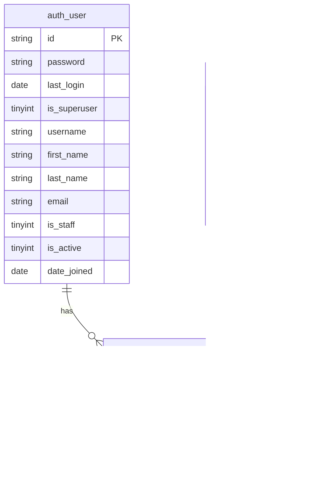

```mermaid
erDiagram
    auth_user {
        string id PK
        string password
        date last_login
        tinyint is_superuser
        string username
        string first_name
        string last_name
        string email
        tinyint is_staff
        tinyint is_active
        date date_joined
    }

    property {
        int id PK
        string address
        string city
        bigint price
        string description
        int year
    }

    likes {
        int id PK
        int user_id FK
        int property_id FK
        date update_date
        tinyint is_active
    }

    auth_user ||--o{ likes : has
    property ||--o{ likes : has
```
